### Linux Productivity Apps
(For Students, Programmers, and Data's People)

# 1. Flow Chart Maker
For people who want chatgpt to generate flow charts.

How to Generate
1. Prompt GPT or any other LLM to writemake a .dot file
2. Run the app executable and either browse for .dot file, or paste.dot file content here

**Sample Prompt** 
```bash
I’m designing a flowchart to explain a process. Please generate a valid Graphviz DOT file (not an image, only the DOT text) using clear structure and labels.

Title: “Student Research Workflow”
Style: simple, left-to-right layout (rankdir=LR), rounded boxes, arrows showing data flow.

Steps to include:
- Define Research Question
- Collect Data
- Clean Data
- Analyze Results
- Write Report
```
3. Select the location where you want to save .PNG Flowchart File.

---

### Example

## **Input**

```dot
digraph T5 {
    rankdir=LR;
    fontsize=12;
    labelloc="t";
    label="T5 Architecture (Encoder–Decoder with High & Low Level Abstractions)";

    // Node styles
    node [shape=box, style=filled, fontname="Helvetica"];

    // Input Embeddings
    input [label="Input Tokens\n(Embeddings + Positional Info)", fillcolor="#cce5ff"];

    // Encoder
    subgraph cluster_encoder {
        label="Encoder Stack (N Layers)";
        style=filled;
        color="#99ccff";
        
        enc_in [label="Input Embedding Vector", fillcolor="#e6f2ff"];
        
        subgraph cluster_enc_layer {
            label="Encoder Layer";
            color="#b3d9ff";
            style=filled;

            enc_self_attn [label="Multi-Head Self-Attention", fillcolor="#ffcccb"];
            enc_norm1 [label="Layer Norm + Residual", fillcolor="#ffe6e6"];
            enc_ffn [label="Feed-Forward Network", fillcolor="#ccffcc"];
            enc_norm2 [label="Layer Norm + Residual", fillcolor="#e6ffe6"];
        }
        
        enc_out [label="Encoder Hidden States\n(Meaning Soup)", fillcolor="#e6f2ff"];
        
        enc_in -> enc_self_attn -> enc_norm1 -> enc_ffn -> enc_norm2 -> enc_out;
    }

    // Decoder
    subgraph cluster_decoder {
        label="Decoder Stack (N Layers)";
        style=filled;
        color="#ffcc99";
        
        dec_in [label="Shifted Output Embeddings", fillcolor="#fff0e6"];
        
        subgraph cluster_dec_layer {
            label="Decoder Layer";
            color="#ffd9b3";
            style=filled;
            
            dec_self_attn [label="Masked Multi-Head Self-Attention", fillcolor="#ffcccb"];
            dec_norm1 [label="Layer Norm + Residual", fillcolor="#ffe6e6"];
            dec_cross_attn [label="Cross-Attention\n(Q=Decoder, K,V=Encoder)", fillcolor="#ffeb99"];
            dec_norm2 [label="Layer Norm + Residual", fillcolor="#fff7cc"];
            dec_ffn [label="Feed-Forward Network", fillcolor="#ccffcc"];
            dec_norm3 [label="Layer Norm + Residual", fillcolor="#e6ffe6"];
        }
        
        dec_out [label="Decoder Hidden States", fillcolor="#fff0e6"];
        
        dec_in -> dec_self_attn -> dec_norm1 -> dec_cross_attn -> dec_norm2 -> dec_ffn -> dec_norm3 -> dec_out;
    }

    // Output
    output [label="Softmax\n(Output Tokens)", fillcolor="#d5f5e3"];

    // Connections
    input -> enc_in;
    enc_out -> dec_cross_attn;
    dec_out -> output;
}

```


### **Output**


---

# 2. Local OCR
For people who needs offline image to text converter.

### Usage Guide
- You can **load** image from file menu or just directly **paste** it from clipboard.
- Then click perform OCR button and text from image will appear.

*Note : For better quality use high quality image*

---

## How to create executable files and run on your systems.

Requirements

- Python 3.8+ 
- PyQt6
- Pillow
- pytesseract
- Graphviz (for Flowchart Maker)
- Tesseract OCR (for OCR Tool)


Install all Python deps in projects .venv:

```bash
pip install PyQt6 pillow pytesseract
```


### System Libraries

### Linux (Ubuntu / Fedora)
Use apt or dnf to install system packages

```bash
# Ubuntu
sudo apt install graphviz tesseract-ocr

# Fedora
sudo dnf install graphviz tesseract
```

### Build Executables :
In your projects virtual environment install pyinstaller and create executable like that :
```bash
pip install pyinstaller
pyinstaller --onefile --windowed flow_chart_maker/flow_chart_maker.py
pyinstaller --onefile --windowed OCR/main.py
```

### For Windows
Windows

Install Python.
Install Graphviz.
Install Tessaract OCR.

Add all to path.

then follow the same process as linux.

### MacOS
Use brew to install system packages :

```bash
brew install python3 graphviz tesseract
pip3 install PyQt6 pillow pytesseract
```

Follow the same process as in linux for creating executable files.